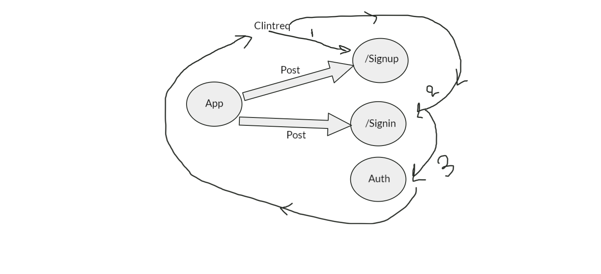

# Heroku :
[Herouko](https://reem-api-server.herokuapp.com/food)
[Herouko](https://reem-api-server.herokuapp.com/clothes)

# Github :
[Github](https://github.com/reem-alqurm/basic-auth)
# pull request :
[Pull Request](https://github.com/reem-alqurm/api-server/pulls?q=is%3Apr+is%3Aclosed)
# Github actions :
[Github Actions](https://github.com/reem-alqurm/basic-auth/actions)

## UML Diagram :

